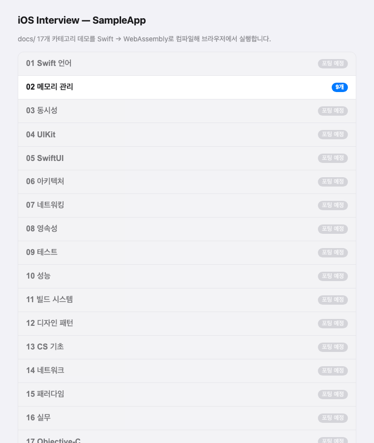

# SampleAppWeb — SampleApp을 WebAssembly로 브라우저에서 실행

`SampleApp`(iOS 데모 앱)의 **데모 로직을 Swift → WebAssembly로 컴파일**해 브라우저에서
실행하는 실험 프로젝트. [Goodnotes의 Swift/Wasm 이식 사례](https://www.swift.org/blog/bringing-goodnotes-to-web-with-swift/)와
같은 전략을 따른다 — **플랫폼 UI는 웹용으로 새로 구현하고, 순수 Swift 로직은 그대로 공유**.



## 왜 "그대로 이식"이 아닌가

`SampleApp`은 100% SwiftUI(일부 UIKit)다. 그런데 **WebAssembly 타깃에는 SwiftUI도 UIKit도 없다**
(Apple 플랫폼 전용 프레임워크). 따라서 SwiftUI 앱을 통째로 wasm에 올릴 수는 없다.

대신 계층을 나눈다:

| 계층 | SampleApp(iOS) | SampleAppWeb |
|---|---|---|
| **UI 렌더링** | SwiftUI `LogView`/`TheoryCard`, `NavigationStack` | JavaScriptKit(DOM) — `Renderer.swift` |
| **데모 로직** | `ConsoleDemoView { log in ... }` 클로저 | 동일 클로저를 `.console`로 이식 (`Demos+*.swift`) |
| **이론 카드** | `TheoryCard(bullets:)` | `.theory([...])` |
| **UIKit VC 데모** | 실제 `UIViewController` | `.iosOnly` — 웹 미지원, 개념 설명만 |

데모의 **비즈니스 로직(ARC 추적, retain cycle, 캡처 리스트 등)은 문자 그대로 같은 Swift 코드**가
브라우저 wasm에서 실행된다.

## 구조

```
SampleAppWeb/
  Package.swift              # JavaScriptKit 의존성, wasm executable 타깃 (Swift 5 언어모드)
  Sources/SampleAppWeb/
    Model.swift              # DemoLogger, DemoBody(.console/.theory/.iosOnly), WebDemo, WebCategory
    Catalog.swift            # 17개 카테고리 목록 (SampleApp의 DemoRegistry 대응)
    Demos+Memory.swift       # 02 메모리 관리 — 이식 완료(9개)
    Renderer.swift           # DOM 네비게이션 + LogView/TheoryCard 재현
    main.swift               # 엔트리: render(.menu)
  www/
    index.html               # CSS + wasm 로더
    autotest.html            # 헤드리스 검증용 자동 클릭 페이지
  build.sh                   # wasm 빌드 + JS 번들 + 정적 자산 복사 → dist/
  serve.sh                   # dist/ 로컬 서빙
```

## 요구 사항 / 설치

Swift 6.2+ 툴체인과 WebAssembly Swift SDK가 필요하다.

```bash
# 1) swiftly (툴체인 매니저)
curl -fsSL -o swiftly.pkg https://download.swift.org/swiftly/darwin/swiftly.pkg
installer -pkg swiftly.pkg -target CurrentUserHomeDirectory
~/.swiftly/bin/swiftly init --assume-yes

# 2) Swift 6.2.4 툴체인
swiftly install 6.2.4

# 3) WebAssembly SDK (버전 정확히 일치해야 함)
swift sdk install \
  https://download.swift.org/swift-6.2.4-release/wasm-sdk/swift-6.2.4-RELEASE/swift-6.2.4-RELEASE_wasm.artifactbundle.tar.gz \
  --checksum <swift.org 게시 체크섬>
# 설치 확인: swift sdk list  →  swift-6.2.4-RELEASE_wasm
```

> `.swift-version` 파일이 이 디렉토리를 6.2.4로 핀 고정한다. 메인 iOS 프로젝트는 Xcode 툴체인을 계속 사용.

## 빌드 / 실행

```bash
./build.sh          # Swift → wasm 컴파일 + JS 글루/런타임 생성 → dist/
./serve.sh          # http://localhost:8099/
```

브라우저에서 http://localhost:8099/ 접속. 첫 로드 시 CDN에서 WASI 심(shim)을 받는다(인터넷 필요).

## 검증 (헤드리스)

Chrome 확장 없이도 headless Chrome으로 렌더/상호작용을 확인할 수 있다:

```bash
CHROME="/Applications/Google Chrome.app/Contents/MacOS/Google Chrome"
"$CHROME" --headless=new --disable-gpu --virtual-time-budget=13000 \
  --screenshot=shot.png "http://localhost:8099/autotest.html"
```

`autotest.html`은 로드 후 자동으로 [메모리 관리 → Retain Cycle → 실행]을 클릭해,
wasm에서 실제 `deinit` 순서가 출력되는지 보여준다.

## 새 카테고리 이식 방법

1. `Demos+<카테고리>.swift` 생성. `SampleApp/Demos/<카테고리>/*.swift`의 각 데모를
   `WebDemo`로 옮긴다:
   - `ConsoleDemoView { log in BODY }`  →  `.console { log in BODY }` (본문 그대로 복사)
   - `TheoryCard(bullets: [...])`        →  `.theory([...])`
   - UIKit `UIViewControllerRepresentable`/커스텀 SwiftUI 뷰  →  `.iosOnly("설명")`
2. `Catalog.swift`의 `placeholder(...)`를 새 `WebCategory`로 교체.
3. `./build.sh` 후 브라우저 확인.

> **주의**: wasm(비-Darwin)에는 `libdispatch`(GCD), `autoreleasepool`, ObjC 런타임, UIKit이 없다.
> `DispatchQueue`·`autoreleasepool`·`objc_*`를 쓰는 데모는 `.theory` 또는 `.iosOnly`로 대체하거나
> `async/await`·`Task`로 바꿔 이식한다.

## 이식 현황

| 카테고리 | 상태 |
|---|---|
| 02 메모리 관리 | ✅ 9개 (autoreleasepool은 이론 카드로 대체) |
| 12 디자인 패턴 | ✅ 6개 (Observer→수동 pub/sub, Builder→String) |
| 13 CS 기초 | ✅ 6개 (타이밍→ContinuousClock, Concurrency primitive→이론) |
| 15 패러다임 | ✅ 4개 (String(format:)→수동 반올림) |
| 그 외 13개 | ⏳ 포팅 예정 (메뉴에 "포팅 예정" 표시) |

현재 **4개 카테고리 25개 데모**가 브라우저 wasm에서 실행된다.
